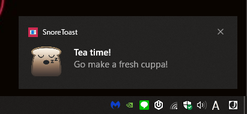

# cronjob-toast-requester

A push based notification NodeJS/REST app that will pop up an OS level toast notification, can be once or multiple times according to a cron expression.



Built using: 
```NodeJS``` 
```Express``` 
```SnoreToast``` 


Tested with: 
```SuperTest```
```Mocha```
```Chai```


## Commands

To build the project:
    ``` npm run build ```

To run the project:
    ``` npm start ```

To test the project:
    ``` npm run test ```

To build and run the project:
    ``` npm run bas ```


## REST API 

Request description:

``` POST /api/v1/cron ``` - Given a valid cron expression, a title and a message a toast will appear multiple times according to the cron expression.

``` POST /api/v1/notify ``` - Given a valid title and message a toast message will appear.

---
### POST ```/api/v1/cron``` 

Example request:
```
POST /login HTTP/1.1
Accept: application/json
Content-Type: application/json
Content-Length: xy

{
    "cron":"* * * * * *",
    "title": "Title of the toast",
    "message": "This message will appear every second!"
}
```

Example response:
```
HTTP/1.1 200 OK
Server: My RESTful API
Content-Type: text/html; charset=utf-8
Content-Length: xy

Notification sent!

```
---
### POST ```/api/v1/notify```

Example request:
```
POST /login HTTP/1.1
Accept: application/json
Content-Type: application/json
Content-Length: xy

{
    "title": "One time toast",
    "message": "This will appear once per request!"
}
```

Example response:
```
HTTP/1.1 200 OK
Server: My RESTful API
Content-Type: text/html; charset=utf-8
Content-Length: xy

Notification sent!

```

# ```- Notice -``` 
This project doesn't persist the cron jobs across server restarts. A database needs to be added, as well as API's for managing current toasts. 


Todo:

- [x] Add one time only notify API
- [x] Add cron API
- [ ] Add a database to persist cron requests
- [ ] Add a GET api for currently running cron jobs owned by the application
- [ ] Add a DELETE api for jobs to be removed
- [ ] Add a front-end 'config panel' to change scheduled cron notifications graphically
- [ ] Add a jenkins job to run the tests

This isn't really an active/useful project, just something for fun. 
